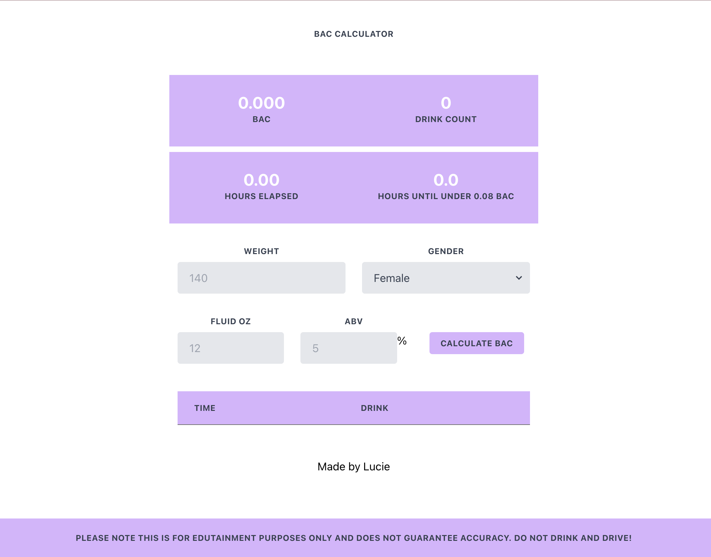

# BAC Calculator

Technologies: React, Typescript, Firebase, Tailwind CSS
Live Site: https://bac-calc-lc.web.app/

## Features

This application calculates your blood alcohol content (BAC) based on the following inputs: weight, gender, fluid ounces and alcohol by volume (ABV).

The first entry logs the initial time that the drinking session began. This is so that the BAC calculation can also take into account elapsed time.

Each drink entry will be logged in a table as well as add to a total drink count.

There is no backend, so no data is stored, and the page will reset once refreshed.

## Ideal Future Features

- Buttons for common alcoholic beverages which would replace manual data entry
- Data persistence to avoid data erasure when page is refreshed
- Readable time formats such as specifying minutes in addition to hours (0.5 hours -> 30 minutes)
- Drink table would show latest drink at the top and populate in descending order of time
- Convert to phone application instead of running in browser

## Home Page

